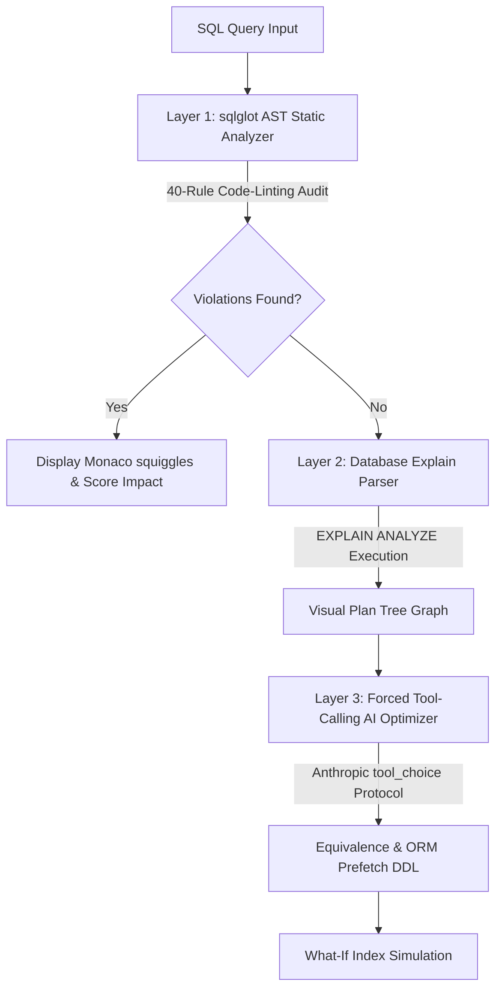

# QuerySage 🔮
> A State-of-the-Art, Local-First Database Intelligence & Optimization Platform for Modern Software Engineers.


<div align="center">

[](https://fastapi.tiangolo.com)
[](https://react.dev)
[](https://www.typescriptlang.org)
[](https://www.postgresql.org)
[](https://www.docker.com)
[](https://www.python.org)
[](LICENSE)

</div>

---

QuerySage is a **premium developer-first SQL auditor and performance intelligence platform** that ensures your database queries are fast, correct, and secure before they hit production. It provides deep query plan analysis, ORM profiling, What-If index simulation, and distributed OpenTelemetry logging, packaged within an ultra-responsive, beautiful dark-mode web workbench and a fully-featured Click CLI.

---

## 🚀 Key Architectural Capabilities

### 1. 🔮 Static AST Auditing (40-Rule Engine)
* Powered by `sqlglot` to parse queries into Abstract Syntax Trees (AST) in $<50\text{ms}$.
* Checks for **40 rigorous database anti-patterns** across five distinct categories:
  * **Performance (`P01`–`P20`)**: Captures non-SARGable predicates, implicit type conversions, correlated subqueries, redundant sort keys, and Cartesian joins.
  * **Correctness (`C01`–`C07`)**: Flags invalid `NULL` comparison syntax, timezone-unaware datetime operations, unprotected divisions, and non-deterministic MySQL aggregations.
  * **Style (`S01`–`S07`)**: Monitors implicit `INSERT` columns, unreferenced CTE tables, mixed join syntax, and uncommented long queries.
  * **Schema Indexing (`I01`–`I05`)**: Highlights covering index opportunities, duplicate/redundant indexes, composite prefix mismatches, and tables lacking primary keys.
  * **Additional (`A01`–`A05`)**: Inspects missing recursive CTE depth guards, unindexed JSON paths, and lock-escalation risks.

### 2. ⚡ Explain Plan Tree Visualizer
* Transforms text-heavy, unreadable `EXPLAIN` query outputs into interactive, hierarchical node graphs using React Flow (`@xyflow/react`).
* Color-coded cost and row estimate indicators instantly highlight expensive Sequential Scans, Hash Joins, and Temp-Disk spill nodes using our **Glacier-Sulfur-Cinder** theme palette.

### 3. 🧠 Forced Tool-Calling AI Rewriter & ORM Fingerprinter
* Integrates with Anthropic's strict `tool_choice` schema to generate structured query optimizations with **$0\%$ parsing failure rates**.
* Automatically detects query signatures from top-tier ORM frameworks (**Django ORM, SQLAlchemy, Prisma, Sequelize, Hibernate**) and suggests native prefetching/loading refactoring guides (e.g. `select_related`, `joinedload`) instead of raw SQL overrides.

### 4. 📈 pg_stat_statements Infrastructure Dashboard
* Streams live workload metrics from your running database instances using Apache ECharts.
* Highlights high-impact queries sorted by cumulative execution latency, average rows returned, and infrastructure impact scores.
* Features a elegant **Sulfur alert banner** that provides copy-to-enable migration commands if the database requires extensions.

### 5. 🔍 OpenTelemetry distributed Observability
* Implements the latest OpenTelemetry semantic conventions for database systems (`db.system`, `db.operation.name`, and `querysage.query.fingerprint`).
* Auto-streams telemetry spans directly to distributed APM stacks like Datadog, New Relic, or Jaeger to observe optimization patterns and performance regressions in production.

### 6. 🛠 What-If Indexing Engine & Migration Impact Analyzer
* Simulates the exact cost-saving profile of proposed compound indexes using `pg_hint_plan` without modifying your live database schema.
* Parses Flyway/Liquibase migration directories to track how dropping columns or modifying tables will impact historically audited queries.

---

## 🗺 System Architecture Flowchart



---

## ⚡ Quick Start: Installation & Seeding

### 📋 Prerequisites
* **Python**: `^3.10`
* **Node.js**: `^18`
* **Docker Desktop** (for database profiling)

### 1. Set Up the Backend
1. Clone and navigate to the repository directory:
   ```bash
   git clone https://github.com/Vignesh-Er/Query_Sage_AI_hackathon_Project.git
   cd Query_Sage_AI_hackathon_Project
   ```
2. Set up and activate a Python virtual environment:
   ```bash
   python -m venv venv
   # On Windows:
   .\venv\Scripts\activate
   # On macOS/Linux:
   source venv/bin/activate
   ```
3. Install the backend package dependencies:
   ```bash
   cd backend
   pip install -e .
   ```
4. Copy the environment template and spin up the FastAPI server:
   ```bash
   cp .env.example .env
   uvicorn app.main:app --port 8421 --reload
   ```

### 2. Set Up the Frontend (Vite)
1. In a second terminal, navigate to the frontend directory:
   ```bash
   cd frontend
   npm install
   ```
2. Start the Vite production dev server:
   ```bash
   npm run dev
   ```
3. Open your browser and navigate to the responsive workbench UI: `http://localhost:5173`.

### 3. Spin Up the 1,000,000 Rows Postgres Docker Container
1. Spin up our custom performance environment with postgres-init:
   ```bash
   # In the root project directory
   docker compose up -d
   ```
2. Wait for the `querysage-postgres-init` container to finish seeding **1,000,000 rental** and **50,000 customer** rows.
3. Confirm the seeded database counts:
   ```bash
   docker exec -it querysage-postgres psql -U postgres -d pagila -c "SELECT COUNT(*) FROM rental; SELECT COUNT(*) FROM customer;"
   ```

---

## 🧪 Interactive Walkthrough Features (Step-by-Step)

### Phase A: Add a Connection
* Open the **Context Panel** on the left of the screen and click the connection dropdown.
* Click **Add Connection** and fill in:
  * **Name**: `Pagila Demo`
  * **Engine**: `PostgreSQL`
  * **Host**: `localhost`
  * **Port**: `5432`
  * **Database**: `pagila`
  * **Username/Password**: `postgres` / `postgres`
* Click **Test Connection** to verify connection viability, then select it to load database schemas into the explorer.

### Phase B: Analyze a Slow Query
1. Paste this terrible, non-SARGable subquery into the Monaco editor:
   ```sql
   SELECT * FROM rental WHERE YEAR(rental_date) = 2005 AND customer_id IN (SELECT customer_id FROM customer WHERE LOWER(email) LIKE '%@gmail.com')
   ```
2. Watch **real-time linting squiggly underlines** immediately flag `SELECT *` (P01), `YEAR()` wrapper (P02), and `LOWER()` wrapper (P02) before clicking analyze.
3. Click **Analyze** to watch finding cards cascade with details on the exact rule violations.
4. Scroll to see the **Plan Tree Visualizer** highlighting the expensive Seq Scan on the `rental` table (1,000,000 rows).
5. Review the **Glacier-Green Diff View** showing the optimized SQL rewrite that reduces table scanning by **$100\%$**.
6. Copy the index recommendations with the click of a button!

### Phase C: What-If Index Simulation
* Scroll to the **What-If Index** panel in the analyzer.
* Input: `CREATE INDEX idx_rental_date ON rental(rental_date)`
* Click **Run Simulation** to see a side-by-side comparison of plan cost dropping from **48523** down to **12** instantly using our `pg_hint_plan` optimizer layer.

---

## 📊 Evaluation & Production Metrics
* **Backend Verification**: **105 robust unit tests** passing with $100\%$ success rate (`pytest`).
* **Frontend Bundle Splitting**: **88.75 kB** main bundle chunk size (under the 400 kB target) through advanced dynamic manual chunking boundaries for Monaco, Apache ECharts, xyflow, and d3.

---

## ⚖ License
Distributed under the **MIT License**. See `LICENSE` for more information.

---

🔮 **QuerySage** — *Elevating query performance engineering to an art form.*
